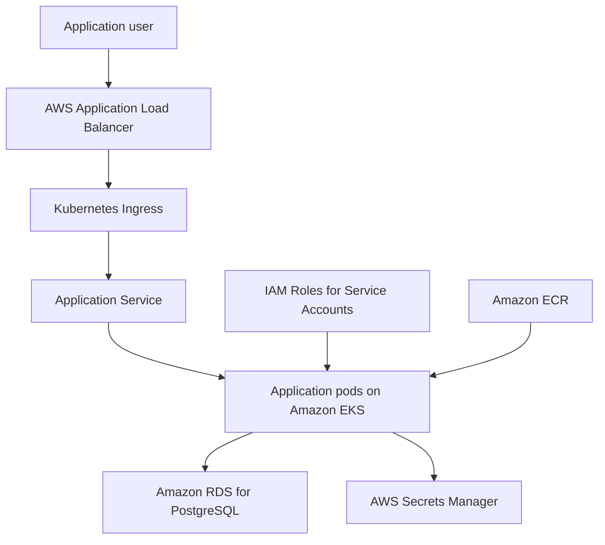

# AWS Platform Infrastructure

[](https://github.com/iam-chandu-vudavagandla/aws-platform-infrastructure/actions/workflows/ci.yaml)

A production-oriented AWS platform reference implementation built with Terraform, Amazon EKS, Kubernetes, PostgreSQL, Docker, and a policy-controlled reliability agent.

The project demonstrates how to provision cloud infrastructure, deploy a containerized application, manage database access through IAM and Secrets Manager, validate changes through CI, and investigate infrastructure failures safely.

## Architecture



The development environment includes:

* A VPC with public and private subnets
* Internet Gateway and NAT Gateway routing
* Security groups for ALB, EKS, and RDS
* Amazon EKS with a managed node group
* IAM roles for the EKS control plane and worker nodes
* IAM OIDC provider and IRSA roles
* Amazon ECR for application images
* Amazon RDS for PostgreSQL
* AWS Secrets Manager for database credentials
* AWS Load Balancer Controller permissions
* Kubernetes Deployment, Service, Ingress, HPA, PDB, ConfigMap, and ServiceAccount

## Key Features

### Infrastructure as Code

Reusable Terraform modules provision:

* VPC networking
* EKS
* IAM
* Security groups
* ECR
* RDS PostgreSQL
* Terraform backend infrastructure

### Kubernetes Workloads

Kustomize manages shared manifests and environment-specific configuration:

* `kubernetes/base` contains reusable application resources.
* `kubernetes/overlays/dev` contains AWS-specific configuration.
* `kubernetes/overlays/local` runs the platform locally with Minikube and PostgreSQL.

The application workload includes:

* Readiness and liveness probes
* Resource requests and limits
* Horizontal Pod Autoscaler
* PodDisruptionBudget
* Dedicated Kubernetes ServiceAccount
* ALB Ingress configuration

### Secure AWS Access

The platform uses IAM Roles for Service Accounts instead of storing long-lived AWS credentials inside application containers.

The application receives permission to read only its database secret from AWS Secrets Manager.

### Local Development

The complete application and PostgreSQL stack can run locally on Minikube.

Automation scripts provide a repeatable workflow:

```bash
./scripts/local-up.sh
./scripts/local-test.sh
./scripts/local-down.sh
```

`local-down.sh` stops Minikube while preserving PostgreSQL data in the local persistent volume.

### Continuous Integration

GitHub Actions validates every pull request with five independent jobs:

* Terraform formatting and validation
* Kubernetes and Kustomize rendering
* Python syntax and reliability-agent tests
* Docker image build
* Basic credential scanning

The workflow performs validation only. It does not run `terraform plan`, `terraform apply`, or modify AWS resources.

### Reliability Agent

The repository includes the first version of an AWS Platform Reliability Agent.

The agent is designed to:

* Inspect Terraform module structure
* Run approved read-only tools
* Collect evidence
* Produce structured incident reports
* Enforce tool-call limits
* Reject unsafe paths and modifying operations

The agent must not:

* Apply or destroy Terraform infrastructure
* Modify Kubernetes resources
* Restart or scale workloads
* Read secret values
* Execute arbitrary shell commands

## Technology Stack

| Area           | Technologies                    |
| -------------- | ------------------------------- |
| Cloud          | AWS                             |
| Infrastructure | Terraform                       |
| Containers     | Docker                          |
| Orchestration  | Amazon EKS, Kubernetes          |
| Configuration  | Kustomize                       |
| Networking     | VPC, ALB, NAT Gateway           |
| Database       | Amazon RDS for PostgreSQL       |
| Registry       | Amazon ECR                      |
| Identity       | IAM, OIDC, IRSA                 |
| Secrets        | AWS Secrets Manager             |
| Application    | Python, Flask, Gunicorn         |
| Agent          | Python, Pydantic, Ollama client |
| Testing        | Pytest, smoke tests             |
| CI             | GitHub Actions                  |

## Repository Structure

```text
.
├── .github/workflows/       GitHub Actions CI
├── application/             Flask application and Dockerfile
├── bootstrap/backend/       Terraform backend bootstrap
├── environments/dev/        Development environment composition
├── kubernetes/
│   ├── base/                Reusable Kubernetes resources
│   └── overlays/
│       ├── dev/             AWS development overlay
│       └── local/           Minikube and PostgreSQL overlay
├── modules/
│   ├── ecr/                 Elastic Container Registry
│   ├── eks/                 EKS cluster and OIDC provider
│   ├── iam/                 EKS IAM roles
│   ├── rds/                 PostgreSQL database
│   ├── security-groups/     ALB, EKS, and RDS security groups
│   └── vpc/                 VPC, subnets, routing, IGW, and NAT
├── platform-agent/          Read-only reliability agent
├── policies/                AWS Load Balancer Controller policy
└── scripts/                 Local lifecycle automation
```

## Application Endpoints

| Endpoint     | Purpose                             |
| ------------ | ----------------------------------- |
| `/`          | Application home page               |
| `/health`    | Liveness endpoint                   |
| `/ready`     | Readiness endpoint                  |
| `/api/info`  | Application and runtime information |
| `/db/health` | PostgreSQL connectivity check       |

## Local Prerequisites

Install:

* Docker
* Minikube
* kubectl
* Python 3.11 or later

Verify:

```bash
docker --version
minikube version
kubectl version --client
python3 --version
```

## Run Locally

Create the ignored local database configuration:

```bash
cp \
  kubernetes/overlays/local/database.env.example \
  kubernetes/overlays/local/database.env
```

Change the example password in `database.env`, then start the platform:

```bash
./scripts/local-up.sh
```

Run smoke tests:

```bash
./scripts/local-test.sh
```

The tests verify:

* Application information endpoint
* PostgreSQL health endpoint

Stop the local cluster while preserving database data:

```bash
./scripts/local-down.sh
```

## Run Reliability-Agent Tests

```bash
cd platform-agent

python3 -m venv .venv
source .venv/bin/activate

python -m pip install --upgrade pip
python -m pip install --editable '.[dev]'

python -m pytest
```

Run the current CLI investigation:

```bash
platform-agent inspect-module modules/vpc
```

The resulting JSON report contains the investigation summary, evidence, confidence level, recommended action, errors, and tool-call trace.

## Terraform Validation

Format the Terraform configuration:

```bash
terraform fmt -check -recursive .
```

Initialize and validate the backend bootstrap without activating a remote backend:

```bash
terraform -chdir=bootstrap/backend \
  init -backend=false -input=false

terraform -chdir=bootstrap/backend \
  validate
```

The development environment supports offline CI validation through a dedicated boolean variable. Its default remains `false`, ensuring normal AWS deployments still validate credentials.

## AWS Deployment Notes

The repository is account-neutral. AWS account IDs, IAM role ARNs, ECR URLs, RDS endpoints, secret ARNs, and backend bucket names are represented by placeholders.

Before deploying to another AWS account:

1. Configure an AWS CLI profile with appropriate permissions.
2. Choose a globally unique Terraform backend bucket name.
3. Bootstrap the Terraform backend.
4. Configure the development backend.
5. Replace environment-specific Kubernetes placeholders using Terraform outputs.
6. Review the Terraform plan carefully.
7. Apply infrastructure only after confirming cost and security impact.
8. Build and push the application image to ECR.
9. Deploy the development Kustomize overlay.

> AWS resources such as NAT Gateway, EKS, ALB, and RDS can generate charges. Review AWS pricing before deployment.

## Security Decisions

* Local credentials and environment files are excluded from Git.
* Terraform state and plan files are excluded from Git.
* Application containers run as a non-root user.
* AWS access uses IRSA rather than embedded access keys.
* Database credentials are stored in Secrets Manager.
* CI uses non-sensitive dummy credentials for offline validation.
* The reliability agent is read-only and policy controlled.
* Pull requests require successful CI checks before merging into `main`.
* Force pushes and branch deletion are restricted on `main`.

## Current Validation

The project has been validated through:

* Terraform formatting and configuration validation
* Kustomize rendering for base, development, and local environments
* Docker application builds
* Minikube deployment
* Application smoke tests
* PostgreSQL connectivity tests
* Reliability-agent unit tests
* GitHub Actions CI

## Roadmap

* Add application unit and integration tests
* Add container vulnerability scanning
* Add Terraform security scanning
* Add Kubernetes policy validation
* Add observability with metrics, logs, and dashboards
* Expand the reliability agent with Kubernetes and AWS read-only tools
* Add evaluation fixtures for repeatable agent testing
* Add automated release versioning
